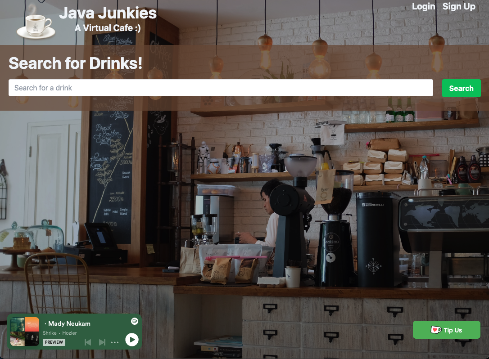

<h1 align=center> Java Junkies </h1>

## License


---

## Description

> Java Junkies virtually brings the coffee shop experience to the comfort of your own home.

---

## Table of Contents

- [License](#license)
- [User Story](#user-story)
- [Technologies](#technologies)
- [Demostration](#demonstration)
- [Collaborators](#collaborators)

---

## User Story

```md
AS A coffee enthusiast,
I WANT a virtual coffee experience
WHERE I can search and save various coffee drinks and their recipes
SO I can recreate the drink at home while easy-listening music in the background
SO THAT I can bring the ambience of a coffee shop to my home.
```

---

## Technologies

- React
- TailwindCSS
- Express.js
- Node.js
- MongoDB
- GraphQL
- JWT Decode
- Apollo Server
- Concurrently
- Heroku
- Github
- Kofi (Tipping/Donation Service)
- The Coffee API (Rapid API)

---

## Demonstration

Click on the link below to start your virtual coffee shop experience today!

[Java Junkies](https://java-junkies-virtual-cafe.herokuapp.com/)



---

## Collaborators

Meet the Java Junkies team:

- [Carli Hudson](https://github.com/carlihudson) - Back-end Functionality, GraphQL Database
- [Siera Ford](https://github.com/sieraford) - Front-End/Back-End Functionality
- [Matt Tobin](https://github.com/Tobin-Matt) - Front-End Functionality, Back-End/Models Functionality
- [Ken Gibson](https://github.com/Klgibsonjr) - UX/UI, React, CSS (Tailwind)
